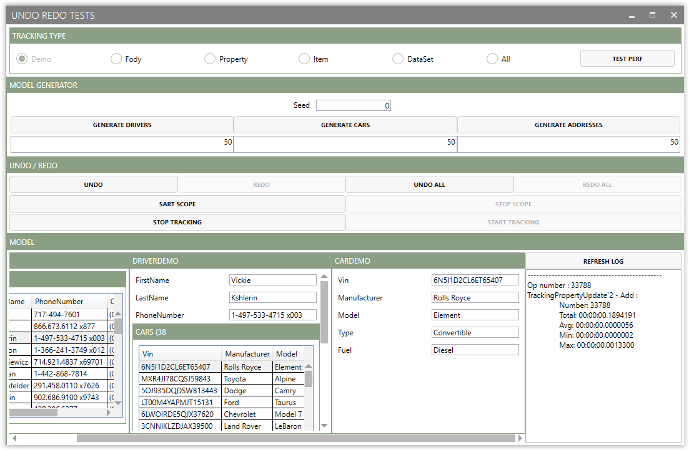

# Undo-redo Manager
[](https://opensource.org/licenses/MIT)


Undo Redo, the best feature that every software should have. But, it is not simple to implement good undo-redo management. You should choose a good strategy to combine performance and maintainability (especially about the granularity of object persistence).

This project is an analysis to compare three types of persistence for undo-redo management.

## Tacking manager
Undo redo concepts need a mechanism to revert and apply changes to a simple object. It's very similar to track all actions (with all information mandatory to revert/apply changes) and save them in a list.
All tracking items should be standalone to manage revert/apply.

With this design, the type of undo-redo is managed by the implementation of ITrackingAction. We can make a PropertyChangedTrackingAction to track actions on properties or make an ItemTrackingAction to track activity on an item or something else.

### Tracking Scope

Track changes by property is the more atomic mechanism. The idea is to keep information on updated property to change this value (by property setter) during revert / apply.

Information mandatory for tracking action:
* Reference to item
* Method to call property setter
* New value (used during apply)
* Old value (used during revert)

To avoid a lot of code without business logic, we use reflection to define a method to call the setter method. This point is more important for performances.
Some try are implemented in the test app to find the best solution.

To improve performance and avoid make refection analyses each call, we can easily make a cache with all method info used.

### Tracking by Data set

Tracking by data set consist to save a snapshot of a Data set (world with all items to include in undo-redo) and apply the good snapshot on the current world. For that, we need one method to duplication the world and another to reset the world state.

The cache with this method is embedded. Indeed, a snapshot is an instance of a cache object.

To be honest, this method is not very compatible with standalone tracking item, but it's enough to compare with other solutions

Due to the general state, it's not possible to know the change that generates state.

### Tracking by Item

Item Tracking is kept a snapshot of the entity when an action occluded on it. This method is the middle between data set and property. To work,  We need the same methods as Data set to duplicate and restore items states.

Save Entities instead of the World need less memory and is more efficient.

Information mandatory for tracking action:
* Reference to item
* Deep copy of old item state (for revert)
* Deep copy of current item state (for apply)


To enhance performance, we can save items copies in a cache. But the items cache is very complicated to manage especially to know when invalidate cache.

### Tracking Collection
Property and item tracking manage only changes on internal states, they do not track collection changes.  Collection is not difficult to track, we need to add a specific tracking action when the collection is updated.

Information mandatory for tracking action:
* Reference to collection
* Action on collection (add or remove)
* updated items
* Position of first item

### Global diagram 



## Fody Usage
[Fody](https://github.com/Fody/Fody) is a great extensible tool for weaving .net assemblies.
With this tool, it is possible to develop a plug in to avoid reflection usage in property tracking. We can generate in compilation time some method to replace setter method info.

Base code:
```cs
[Tracking]
public class TestModel
{
  public int Value { get; set; }
}
```
Generated code:
```cs
[Tracking]
public class BaseModel
{
  private TrackingManager trackingManager;

  public int Value
  {
    [CompilerGenerated]
    get
    {
      return Value;
    }
    [CompilerGenerated]
    set
    {
      if (Value != value)
      {
        trackingManager.AddAction(this.GetTrackingPropertyUpdateFunc(Value, value, new Action<BaseModel, int>(TrackingItemSetter_Value)));
      }
      Value = value;
    }
  }  
  public BaseModel()
  {
      trackingManager = TrackingManagerProvider.GetDefault();
  }  
  private static void TrackingItemSetter_Value(BaseModel P_0, int P_1)
  {
      P_0.Value = P_1;
  }
}

```

## Analysis Results

###  Persistence Requirements
|           Property          |          Item                    |     Data Set                     |                 Fody                |
|:---------------------------:|:--------------------------------:|:--------------------------------:|:-----------------------------------:|
| Reflection for generic code | Keep one item reference per item | Keep one item reference per item | Framework to generate code on build |
|                             | Save item state methods          | Save item state methods          |                                     |
|                             | Restore item state methods       | Restore item state methods       |                                     |
|                             |                                  | Entry point                      |                                     |

###  Persistence compare
|               |          Property          |          Item                                              |                              Data Set                              |             Fody             |
|---------------|:--------------------------:|:----------------------------------------------------------:|:------------------------------------------------------------------:|:----------------------------:|
| Advantages    | Simple, atomic             |                                                            | Save always global state, No logic between state                   | No code to manage undo redo  |
| Disadvantages | Performance of reflection  | Cache is very difficult to manage especially invalidation  | Space to save all sates, No information about changes(global view) | Code of Fody plug in complex |
| Optimization  | Cache of method infos      | Cache of Item                                              | Cache of World                                                     | N/A (specific code)          |
| Performance   | Good                       | Depends of item size                                       | Depends of Wold size                                               | Good                         |
| Complexity    | Simple                     | Very complex                                               | Simple                                                             | Medium                       |


## Analysis details

To test the performance of methods, an application has been developed to take action on a simple model (driver, address, car). Tests include only changes in properties.

### performance results
Test parameters:
* Seed: 3
* Driver number: 40
* Car number: 40
* Address number: 40

| Operation | Number | Property   | Item       | DataSet    | Fody       |
|-----------|--------|------------|------------|------------|------------|
| Creation  | 19272  | 00.1454487 | 00.2377482 | 39.9245249 | **00.0538056** |
| Revert    | 19272  | 00.0316663 | 00.0428675 | 16.2472283 | **00.0138809** |
| Apply     | 19272  | 00.0315690 | 00.0434608 | 16.3403993 | **00.0212801** |


### Interface of Test application 

