# undo-redo-manager

Undo Redo, the best feature that every software should have. But, it is not simple to implement a good undo redo management. You should chose the good strategy to combine performance and maintainability. Specially about the granularity of object persistences.

This project is an analyze to compare three type of persistences for undo redo management.

## Tacking manager
Undo redo concept need mechanism to revert and apply changes on simple object. It's very similar to track all actions (with all informations mandatory to revert/apply changes) and save them in list. 

With this design, the type of undo redo is managed by implementation of ITrackinAction, we can make a PropertyChangedTrackingAction to track action of properties or make an ItemTracikingAction to track action on item or something else.

### Tracking by property

Track changes by property is the more atomic mechanism. the idea is keep a reference to updated item and setter method info to managed revert/apply. The refection used to get setter method info is the more important point for good performances.
Some try are implemented in test app to find the best solution.

To improve performance and avoid make refection analyses each call, we can easy make a cache with all method info used.

### Tracking by Data set

### Tracking by Item

### Tracking Scope

Sometime we need group some changes inside one action. For that, the tracking scope provide a way to save all actions inside the scope. At this end , new MultiTractionAction was create with all changes (list of ITrackingAction).

### Tracking Collection
Property and item tracking managed only changes on internal states, they not track collection changed. 

## Analyze Results

###  Persistence Requirements
|           Property          |          Item                    |     Data Set                     |                 Fody                |
|:---------------------------:|:--------------------------------:|:--------------------------------:|:-----------------------------------:|
| Reflection for generic code | Keep one item reference per item | Keep one item reference per item | Framework to generate code on build |
|                             | Save item state methods          | Save item state methods          |                                     |
|                             | Restore item state methods       | Restore item state methods       |                                     |
|                             |                                  | Entry point                      |                                     |

###  Persistence compare
|               |          Property          |          Item                                              |                              Data Set                              |             Fody             |
|---------------|:--------------------------:|:----------------------------------------------------------:|:------------------------------------------------------------------:|:----------------------------:|
| Advantages    | Simple, atomic             |                                                            | Save always global state, No logic between state                   | No code to manage undo redo  |
| Disadvantages | Performance of reflection  | Cache is very difficult to managed specially invalidation  | Space to save all sates, No information about changes(global view) | Code of Fody plug in complex |
| Optimization  | Cache of method infos      | Item cache                                                 | Entry point                                                        | N/A (specific code)          |
| Performance   | Good                       | depends of item size                                       | depends of entry point size                                        | Good                         |
| Complexity    | Simple                     | very complex                                               | Simple                                                             | Medium                       |

## Analyse details

